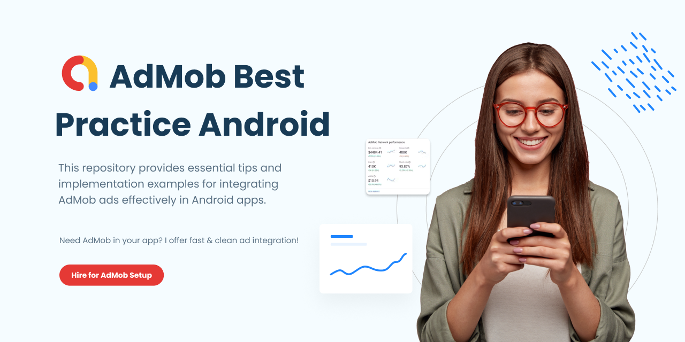

<h2 align="center">AdMob Best Practices Android</h2>

This repository provides essential tips and implementation examples for integrating AdMob ads effectively in Android apps. Learn how to choose the right ad formats, avoid accidental clicks, follow Google’s ad policies, and preload ads for better performance—all with clean, developer-friendly code.

Best practices for integrating AdMob ads in Android apps (Banner, Interstitial, Rewarded, Native) with clean, reusable code.

Elevate your Android app to the next level with our state-of-the-art solutions! Contact us today and let’s create something extraordinary!

<div align="start">
  
<a href="mailto:banrossyn@gmail.com"></a>
[](https://instagram.com/rohitraj.khorwal) [](https://www.linkedin.com/in/rohitrajkhorwal/) [](https://medium.com/@rohitrajkhorwal) 
<a href="https://t.me/banrossyn" target="_blank"></a>
<a href="https://wa.me/+919694260426/" target="_blank">
</div>


<p align="center">
    <a href="/HIRE_ME.md">
      
    </a>
  </p>

[](/HIRE_ME.md)

## 📌 About This Repo

This is an ongoing project where I will be adding practical examples and code for all major AdMob ad formats, including:

- Banner Ads  
- Interstitial Ads  
- Rewarded Ads  
- Native Ads  

Each implementation will follow Google's latest policies and monetization strategies to ensure the best results in terms of both user experience and revenue.

Stay tuned for upcoming commits where you'll find easy-to-follow and reusable code for all ad types.


## Find this Repository useful? ❤️

Support it by joining stargazers for this repository. ⭐

Also, [follow me on GitHub](https://github.com/AndroidWithRossyn/) for my next creations! 🤩

<p align="left">
<a href="https://github.com/AndroidWithRossyn?tab=repositories&sort=stargazers"></a>
  
</p>

## 💖 Support

If you’d like to support this project:

[](https://github.com/sponsors/AndroidWithRossyn)
[](https://www.paypal.com/paypalme/banrossyn)


## 🙌 Contribute

Pull requests are welcome. For major changes, please open an issue first to discuss what you would like to change.


`Note:` Please review our [Code of Conduct](./CODE_OF_CONDUCT.md) before using this project.

## License

```
Copyright: 
~ Rohitraj Khorwal

Licensed under the Apache License, Version 2.0 (the "License");
you may not use this file except in compliance with the License.
You may obtain a copy of the License at

   http://www.apache.org/licenses/LICENSE-2.0

Unless required by applicable law or agreed to in writing, software
distributed under the License is distributed on an "AS IS" BASIS,
WITHOUT WARRANTIES OR CONDITIONS OF ANY KIND, either express or implied.
See the License for the specific language governing permissions and
limitations under the License.
```

<p align="center">
  
</p>